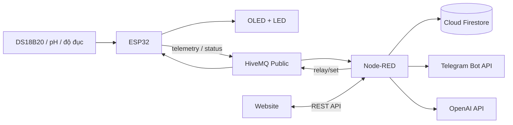

# Aqua IoT Monitoring System

Hệ thống IoT giám sát nước hồ cá sử dụng ESP32, MQTT, Node-RED, Firestore và giao diện web. ESP32 đọc cảm biến, hiển thị cảnh báo tại chỗ, gửi telemetry qua MQTT và nhận lệnh điều khiển relay. Node-RED làm backend, lưu lịch sử, phát cảnh báo Telegram và cung cấp dữ liệu cho website.

## Tính năng

- Đo nhiệt độ nước bằng cảm biến DS18B20.
- Đọc tín hiệu analog từ module pH và cảm biến độ đục.
- Hiển thị độ đục và trạng thái nước trên OLED SSD1306.
- Báo trạng thái độ đục bằng LED xanh/đỏ.
- Bật/tắt relay từ website qua Node-RED và MQTT.
- Theo dõi nhiệt độ, pH, trạng thái relay và trạng thái kết nối của ESP32.
- Lưu telemetry vào Firestore theo chu kỳ tối đa một bản ghi/phút.
- Xem lịch sử theo 6 giờ, 24 giờ, 7 ngày hoặc 30 ngày bằng bảng và biểu đồ.
- Gửi cảnh báo Telegram khi nhiệt độ hoặc pH vượt ngưỡng.
- Hỏi trợ lý AI về dữ liệu hiện tại thông qua OpenAI API hoặc endpoint tương thích.

## Kiến trúc



Luồng điều khiển relay dùng telemetry từ ESP32 làm nguồn sự thật: HTTP `202` chỉ xác nhận backend đã gửi lệnh MQTT, còn trạng thái trên website chỉ đổi sau khi ESP32 phản hồi trong gói telemetry tiếp theo.

## Công nghệ sử dụng

| Thành phần | Công nghệ |
| --- | --- |
| Thiết bị | ESP32, Arduino framework |
| Cảm biến | DS18B20, module pH analog, cảm biến độ đục analog |
| Hiển thị và chấp hành | OLED SSD1306, LED, relay |
| Giao tiếp | MQTT 3.1.1 qua `broker.hivemq.com:1883` |
| Backend | Node-RED 5, Node.js |
| Lưu trữ | Firebase Admin SDK, Cloud Firestore |
| AI | OpenAI Responses API |
| Frontend | HTML, CSS, JavaScript, Chart.js 4 |

## Cấu trúc repository

```text
.
├── docs/
│   └── mqtt-contract.md          Contract topic và payload MQTT
├── firmware/
│   └── aqua_iot_selfcode.ino     Firmware ESP32
├── nodered/
│   ├── flows.json                Flow MQTT, API, Firestore, Telegram và AI
│   ├── lib/
│   │   ├── firebase.js           Đọc/ghi telemetry trên Firestore
│   │   └── openai.js             Gọi OpenAI Responses API
│   ├── package.json
│   └── settings.js               Cấu hình Node-RED và static website
├── website/
│   ├── index.html
│   ├── app.js
│   └── styles.css
└── README.md
```

Các file `.config.*`, file backup và `flows_cred.json` trong `nodered/` là dữ liệu runtime do Node-RED tạo ra, không phải mã nguồn chính của ứng dụng.

## Phần cứng và pinout

Pin hiện được khai báo trong `firmware/aqua_iot_selfcode.ino`:

| Thiết bị | GPIO ESP32 | Ghi chú |
| --- | ---: | --- |
| DS18B20 data | 13 | Cần điện trở kéo lên phù hợp cho bus OneWire |
| Module pH | 34 | ADC input-only, attenuation 11 dB |
| Cảm biến độ đục | 35 | ADC input-only, attenuation 11 dB |
| LED xanh | 18 | Báo độ đục bình thường |
| LED đỏ | 19 | Báo nước quá đục |
| Relay | 26 | Firmware hiện xuất `HIGH` khi bật |
| OLED SDA | 22 | I2C |
| OLED SCL | 23 | I2C |
| OLED address | `0x3C` | SSD1306 128 x 64 |

> Đảm bảo điện áp đầu ra của các module analog không vượt quá mức an toàn của ADC ESP32. Kiểm tra loại relay đang dùng là active-high hay active-low trước khi nối tải thực tế.

## Yêu cầu

### Backend

- Node.js `>= 22.9`.
- npm.
- Kết nối Internet để dùng HiveMQ, Firestore, Telegram, OpenAI và tải Chart.js từ CDN.

### Firmware

- Arduino IDE hoặc môi trường build ESP32 tương đương.
- ESP32 board package.
- Các thư viện Arduino:
  - `PubSubClient`
  - `OneWire`
  - `DallasTemperature`
  - `Adafruit GFX Library`
  - `Adafruit SSD1306`

## Cài đặt backend và website

### 1. Cài dependency

```bash
cd nodered
npm ci
```

### 2. Tạo file môi trường

Tạo `nodered/.env` với các biến cần dùng:

```dotenv
# Bắt buộc để lưu và đọc lịch sử Firestore.
# Đường dẫn được resolve từ thư mục nodered/.
FIREBASE_SERVICE_ACCOUNT_PATH=../secrets/firebase-service-account.json

# Tùy chọn: gửi cảnh báo Telegram.
TELEGRAM_BOT_TOKEN=
TELEGRAM_CHAT_ID=

# Tùy chọn: trợ lý AI trên website.
OPENAI_API_KEY=
OPENAI_BASE_URL=
OPENAI_MODEL=gpt-5.4-mini
```

`OPENAI_BASE_URL` có thể để trống để dùng endpoint mặc định. Nếu đặt giá trị, backend yêu cầu URL dùng HTTPS.

### 3. Cấu hình Firebase

1. Tạo Firebase project và bật Cloud Firestore.
2. Tạo service account key từ Firebase Console.
3. Lưu JSON key ngoài mã nguồn, ví dụ `secrets/firebase-service-account.json`.
4. Trỏ `FIREBASE_SERVICE_ACCOUNT_PATH` đến file đó.

Telemetry được lưu trong collection `aquaTelemetry`. Dashboard thời gian thực và điều khiển relay vẫn hoạt động khi chưa cấu hình Firebase, nhưng lưu trữ và API lịch sử sẽ báo lỗi.

### 4. Khởi động

Từ thư mục `nodered/`:

```bash
npm start
```

Mặc định hệ thống chạy tại:

| Địa chỉ | Nội dung |
| --- | --- |
| `http://localhost:1880/` | Website giám sát |
| `http://localhost:1880/red` | Node-RED editor |
| `http://localhost:1880/api/*` | REST API |

Có thể đổi cổng bằng biến môi trường `PORT`:

```bash
PORT=3000 npm start
```

## Cấu hình và nạp firmware

1. Mở `firmware/aqua_iot_selfcode.ino`.
2. Thay `WIFI_SSID` và `WIFI_PASSWORD` bằng Wi-Fi 2.4 GHz của bạn.
3. Kiểm tra `deviceId` là `aqua_device_01`. Node-RED hiện subscribe đúng ID này; nếu đổi ID trong firmware, cần đổi toàn bộ topic và hằng `DEVICE_ID` tương ứng trong `nodered/flows.json`.
4. Chọn board và cổng serial của ESP32, sau đó build và upload.
5. Mở Serial Monitor ở baud rate `115200` để theo dõi Wi-Fi, MQTT và dữ liệu cảm biến.

Firmware đọc cảm biến mỗi 3 giây, thử kết nối lại MQTT mỗi 5 giây và tiếp tục đo/hiển thị cục bộ nếu không có mạng.

> **Lưu ý trước khi build:** phiên bản firmware hiện tại đọc `phRaw` nhưng chưa có công thức hiệu chuẩn để tạo giá trị `ph`; hàm `publishTelemetry()` đang tham chiếu biến `ph` chưa được định nghĩa. Cần hoàn thiện bước chuyển đổi pH hoặc gửi `null` theo MQTT contract trước khi firmware có thể build và cung cấp pH đáng tin cậy.

## MQTT contract

Broker và topic đang dùng:

```text
Broker: broker.hivemq.com
Port:   1883
Base:   aqua-iot/nhom18/aqua_device_01
```

| Topic | Hướng | QoS | Retain | Payload |
| --- | --- | ---: | --- | --- |
| `.../telemetry` | ESP32 → Node-RED | 0 | Không | `{"temperature":27.5,"ph":7.1,"relayOn":false}` |
| `.../status` | ESP32 → Node-RED | 1 | Có | `online` hoặc `offline` |
| `.../relay/set` | Node-RED → ESP32 | 1 | Không | `{"relayOn":true}` |

ESP32 đăng ký Last Will `offline` và publish retained status `online` sau khi kết nối. Contract đầy đủ nằm trong [`docs/mqtt-contract.md`](docs/mqtt-contract.md).

> HiveMQ public broker không mã hóa, không xác thực và dùng chung với cộng đồng. Cấu hình hiện tại phù hợp cho demo/học tập, không phù hợp để điều khiển thiết bị thật qua Internet hoặc truyền dữ liệu nhạy cảm.

## REST API

### Dashboard hiện tại

```http
GET /api/dashboard
```

Trả về telemetry mới nhất, trạng thái online/offline và thời gian server. Thiết bị được xem là offline nếu không có telemetry hoặc status mới trong khoảng 10 giây.

### Điều khiển relay

```http
POST /api/relay
Content-Type: application/json

{"relayOn":true}
```

`relayOn` bắt buộc là boolean. API trả `202 Accepted` sau khi publish lệnh MQTT.

### Đọc lịch sử

```http
GET /api/history?hours=24&limit=100
```

| Tham số | Mặc định | Giới hạn |
| --- | ---: | --- |
| `hours` | 24 | Số nguyên từ 1 đến 2160 |
| `limit` | 360 | Số nguyên từ 1 đến 1000 |

API này yêu cầu Firestore được cấu hình.

### Trợ lý AI

```http
POST /api/chat
Content-Type: application/json

{"question":"Nhiệt độ hiện tại có bình thường không?"}
```

Câu hỏi không được để trống và tối đa 500 ký tự. Backend chỉ gửi cho mô hình telemetry mới nhất, trạng thái thiết bị, ngưỡng cảnh báo và thời gian server; API này yêu cầu cấu hình OpenAI.

## Lưu trữ và cảnh báo

- Telemetry mới nhất và trạng thái thiết bị được giữ trong global context của Node-RED.
- Firestore chỉ nhận tối đa một bản ghi mỗi 60 giây để hạn chế số lần ghi.
- Nhiệt độ bình thường được cấu hình từ `24 °C` đến `30 °C`.
- pH bình thường được cấu hình từ `6.5` đến `8.0`.
- Mỗi loại cảnh báo có cooldown 10 phút trước khi gửi lại qua Telegram.
- Ngưỡng độ đục mặc định là ADC raw `< 200`; cảnh báo này chỉ hiển thị cục bộ bằng OLED và LED.

## Giới hạn hiện tại

- Hệ thống được cấu hình cho một thiết bị cố định: `aqua_device_01`.
- Firmware chưa hoàn thiện phép hiệu chuẩn pH và đang có tham chiếu đến biến `ph` chưa định nghĩa.
- Giá trị độ đục chưa được đưa vào telemetry, Firestore hoặc website.
- Dữ liệu realtime trong global context bị mất khi Node-RED khởi động lại; lịch sử Firestore vẫn được giữ.
- Node-RED editor và REST API chưa có xác thực; MQTT đang dùng kết nối TCP không mã hóa tới broker công cộng.
- Website tải Chart.js từ CDN nên biểu đồ cần kết nối Internet.
- Repository chưa có test tự động; script `npm test` hiện chỉ là placeholder và trả lỗi.

## Bảo mật

- Không commit `nodered/.env`, Firebase service account, API key, token Telegram hoặc file credential/runtime của Node-RED.
- Nếu thông tin bí mật từng được đưa lên Git, hãy thu hồi và tạo lại key/token; chỉ xóa file khỏi commit mới là chưa đủ.
- Bật `adminAuth`, HTTPS và xác thực API trước khi triển khai Node-RED ra mạng công cộng.
- Dùng broker MQTT riêng có TLS, tài khoản và ACL topic cho môi trường production.
- Đổi device ID/client ID để tránh xung đột topic khi nhiều người chạy cùng project trên HiveMQ public.

## Khắc phục sự cố

| Hiện tượng | Kiểm tra |
| --- | --- |
| Website mở được nhưng không có dữ liệu | Serial Monitor, kết nối Wi-Fi/MQTT và Device ID giữa firmware với flow |
| Thiết bị luôn offline | Telemetry phải đến trong vòng 10 giây; kiểm tra topic `/telemetry` và `/status` |
| Không điều khiển được relay | Topic `/relay/set`, loại relay active-high/active-low và nguồn cấp relay |
| Lịch sử trả lỗi 500 | `FIREBASE_SERVICE_ACCOUNT_PATH`, quyền service account và Firestore đã được bật |
| Chat trả lỗi 500 | `OPENAI_API_KEY`, `OPENAI_BASE_URL`, model và kết nối Internet |
| Không có tin nhắn Telegram | `TELEGRAM_BOT_TOKEN`, `TELEGRAM_CHAT_ID` và ngưỡng/cooldown cảnh báo |
| OLED không hiển thị | Địa chỉ I2C `0x3C`, dây SDA/SCL và nguồn cấp |
| Firmware build lỗi tại `ph` | Hoàn thiện biến/công thức pH hoặc xuất `null` như mô tả trong MQTT contract |

## Phạm vi sử dụng

Đây là project học tập và prototype giám sát hồ cá. Các ngưỡng, phép hiệu chuẩn, mạch bảo vệ, cách ly relay và cơ chế bảo mật cần được kiểm chứng lại trước khi dùng với thiết bị hoặc sinh vật sống trong môi trường thực tế.
